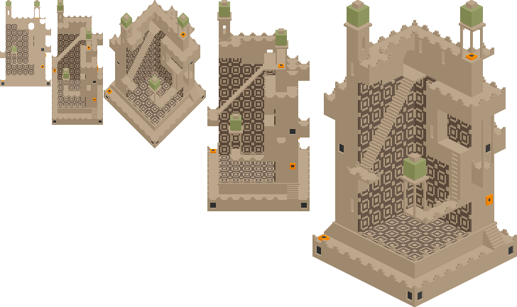

A CLI pixel art renderer for [MagicaVoxel] files.



```
USAGE:
    isomagic [OPTIONS] <filename>

FLAGS:
    -h, --help       Prints help information
    -V, --version    Prints version information

OPTIONS:
    -m, --model <model>      Which model in the voxel file to render [default: all]
    -o, --output <output>    The output directory to write files to [default: .]
    -s, --side <side>        Which side of the model to render [default: all]
    -v, --view <view>        Which perspective of the model to render [default: all]

ARGS:
    <filename>    Input .vox model
```

[MagicaVoxel]: https://ephtracy.github.io/